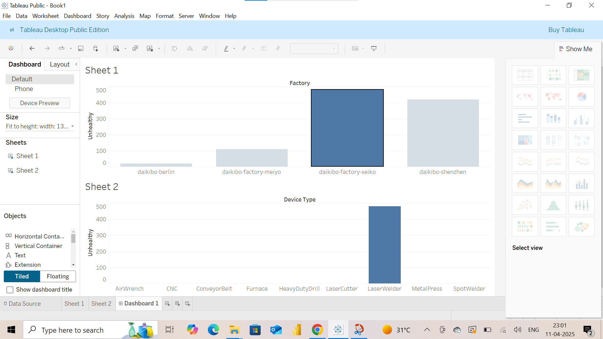

# Deloitte Australia Data Analytics Virtual Internship

This repository contains my completed task for the **Deloitte Australia Data Analytics Virtual Job Simulation** hosted on Forage.

## 📊 Project Overview:

As part of the simulation, I analyzed client operational data to generate business insights, develop visualizations, and prepare reports for internal stakeholders.

## 🛠️ Tools & Skills Used:
- **Microsoft Excel**
- **Tableau Public**
- Data Cleaning & Formatting
- Data Analysis & Insight Generation
- Dashboard Creation

## 📌 Deliverables:

- 📑 **Equality Table (Excel File):**  
  [Task 5 Equality Table.xlsx](./Task%205%20Equality%20Table.xlsx)  

- 📊 **Operational Health Dashboard (Tableau Image):**  
  

## 📈 Key Outcomes:

- Cleaned and prepared equality and operational data for analysis.
- Created an interactive Tableau dashboard to visualize factory and device type performance.
- Identified operational inefficiencies and suggested improvements.

## 📅 Completed:
**April 2025**

---

✅ Virtual Internship hosted on [Forage](https://www.theforage.com/)

